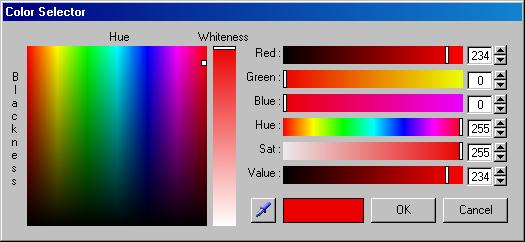



## EGL\_ColorSelector

### Description

Like a 3DS Max color selector dialog box. (Zip:11kb)
 
### More Info
 

             |
---                |---
**Submitted On**   |2011-06-12 23:40:02
**By**             |[Erkan Sanli](https://github.com/Planet-Source-Code/PSCIndex/blob/master/ByAuthor/erkan-sanli.md)
**Level**          |Intermediate
**User Rating**    |5.0 (10 globes from 2 users)
**Compatibility**  |VB 5\.0, VB 6\.0
**Category**       |[Graphics](https://github.com/Planet-Source-Code/PSCIndex/blob/master/ByCategory/graphics__1-46.md)
**World**          |[Visual Basic](https://github.com/Planet-Source-Code/PSCIndex/blob/master/ByWorld/visual-basic.md)
**Archive File**   |[EGL\_ColorS2206416152011\.zip](https://github.com/Planet-Source-Code/erkan-sanli-egl-colorselector__1-73954/archive/master.zip)

